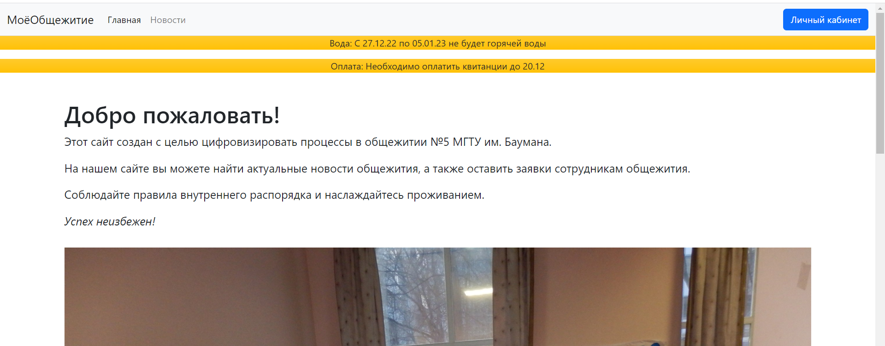
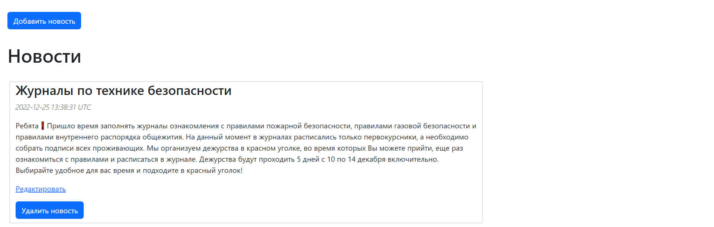
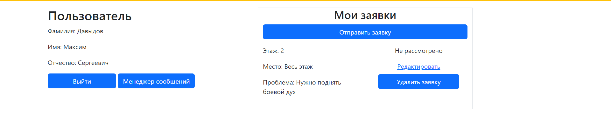

# Dormitory

This is my project that has been made for my dormitory in way to simplify working processes. Via this web app council members and staff can interact with students in a comfortable and fast way.

## Description

* Every user has one of three access levels: student, council member and staff
* Students can make requests and staff will manage them.
* Council members write necessary messages and news seen by other users

## Features & technologies

* Ruby version 3.0.0
* Ruby on Rails version 7.0.4
* Tests RSpec + SeleniumIDE
* Bootstrap & Animate.css

## Get started

1. Install `Ruby` version `3.0.0` for example by `rvm`

```Bash
rvm install 3.0.0
```

2. Install `Ruby on Rails`

```Bash
gem install rails
```

3. Clone the repository

```bash
git clone https://github.com/kek-flip/dormitory
```
4. Install all gems via bundle

```Bash
bundle install
```

5. Run server

```Bash
rails s
```

## Gallery




